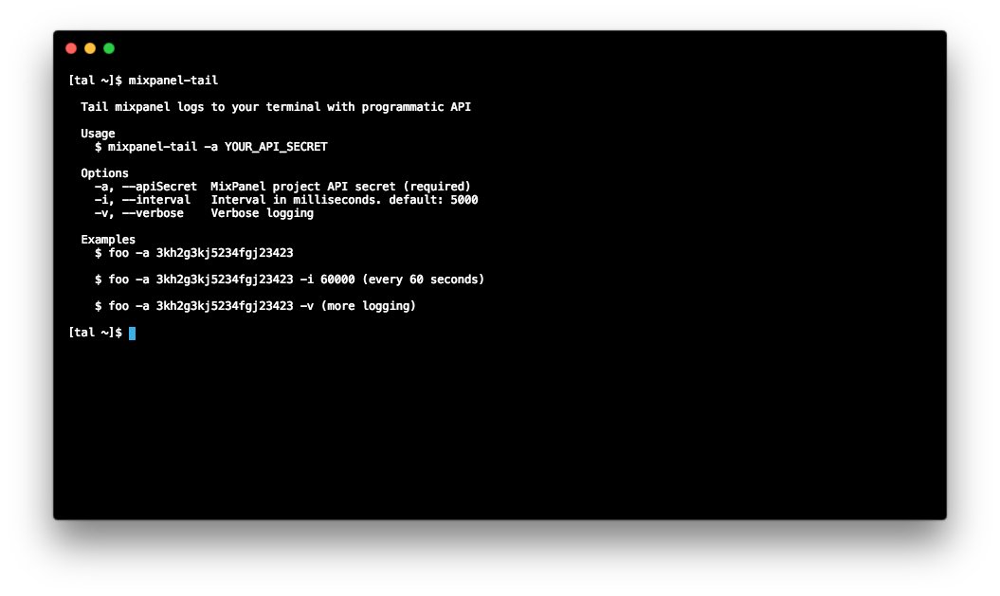

# mixpanel-tail
Stream your Mixpanel live events to your terminal



## CLI

### Install

```
npm install -g mixpanel-tail
```

### Run

Get your API_SECRET from the Mixpanel dashboard of your project

```
mixpanel-tail -a YOUR_API_SECRET
```

That's it! Logs will stream to your terminal

### Help

See all possible options with:

```
mixpanel-tail --help
```

## Programmatic API

### Install

```
npm install mixpanel-tail --save
```

### Use

```js
const mixpanelTail = require('mixpanel-tail')

mixpanelTail({
  apiSecret: 'YOUR_API_SECRET', // required
  interval: 5000,
  verbose: false,
  startTime: Date.now(),
  handler: (arrayOfMixpanelEvents) => console.log('The events', arrayOfMixpanelEvents)
})
```

Use the `handler` to make interesting stuff, like streaming events to Slack.

## Frequently Asked Questions

### Is this affiliated or endorsed by Mixpanel?

No. This project is not affiliated or endorsed by Mixpanel.

### Who made this?

- Torii - https://toriihq.com
- Tal Bereznitskey. Find me on Twitter as @ketacode at https://twitter.com/ketacode
